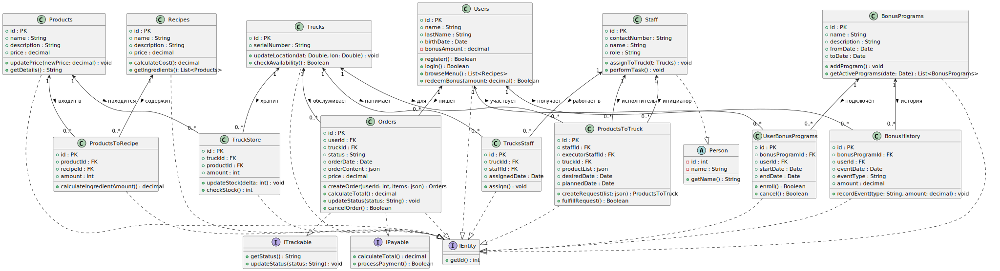

---

marp: true

theme: default

paginate: true

---

# Архитектура системы Food Tech

**Роль**: Архитектор приложений и решений **Кондратов Александр**

**Проект**: Автоматизация работы фуд‑траков с возможностью модификации рецептов

---

## Бизнес‑контекст

- **Цель стартапа**: приготовление блюд с возможностью модификации рецептов в непосредственной близости к пользователю

- **Ключевая ценность**: индивидуальные рецепты → основная прибыль

- IT‑система — надёжный каркас, а не цель

---

## Исходные требования

Мобильный интерфейс повара — минимум кликов
Умная маршрутизация фуд‑траков
Кастомизация рецептов (ингредиенты)
Автоматическое снабжение
Уведомления клиентов и оплата в приложении
Интеграции: бухгалтерия, закупки, лояльность
Аналитика по продажам и маршрутам
Оптимизация стоимость и скорости разработки MVP

---
## Высокоуровневая архитектура

> **Рисунок**: DFD (Data Flow Diagram) — потоки данных между клиентами, траками, поддержкой.

---

## Доменные модели

> **Рисунок**: Class Diagram — основные сущности: Orders, Trucks, Users, Recipes.

---

## Прогноз нагрузки

 

   

кол-во мест скопления людей в городе

- 73 станции метро
- 964 парка, сада и сквера
- 246 торговых объектов
- 200 музеев
- 70 театров
- 50 кинотеатров
- 5 вокзалов

<b style="font-size: 29px;">

итого: 1600 объектов
</b>

400 фуд траков * 12 заказов в час = 48 000 заказов в час
13 заказов в секунду
 
<b>13 транзакций записи в секунду, в самые загруженные часы.</b>

400 фуд. траков * 12 заказов в час * 10 коэф. Ищущих пользователей * 100 запросов на сессию в час  = 4800000 запросов в час на чтение
 
<b>1300 запросов на чтение в секунду</b>

---
## Прогноз возможностей системы (postgresql)

Операции на запись
 
pgbench -c 16 -j 4 -T 60 --protocol=prepared --builtin=simple-update pgbench
 
 
tps = 19621.686927

Операции на чтение
 
pgbench -c 16 -j 4 -T 60 --protocol=prepared --builtin=select pgbench
 
 
tps = 266352.589906

---

## Развёртывание и инфраструктура

> **Рисунок**: Deployment Diagram — сервисы (API, Web, DB), мобильные клиенты, брокер сообщений, CDN.

---

##

---

## Нефункциональные качества

- **Быстрый выход в прод, непрерывное развертывание**

  - Микросервисы + Docker + CI/CD (Jenkins → Kubernetes), Yandex Cloud

- **Лёгкая модификация**

  - Чёткие контракты API (OpenAPI), независимые сервисы

- **Масштабируемость**

  - Автоскейлинг, кэширование (Redis), CDN для статики, разбиение по городам

---

## Интеграции и безопасность

- Аутентификация: Аутентификация через vkontakte, google и других...

- Платежи и лояльность: API платёжного провайдера

- Бухгалтерия & закупки: интеграции с 1C, система нотификаций и оповещений с фуд-траков

- Шифрование трафика и данных (TLS, AES)

---

## Аналитика и мониторинг

- Метрики маршрутов, продаж, остатки

- Дашборды (Grafana, ClickHouse), логирование (ELK)

- Нотификации на отклонения в запасах и нагрузке

---

## Дорожная карта

1. MVP : регистрация, меню, возможность кастомизации существующих рецептов, оплата, навигация фуд траков.

2. Развитие: Реализация заявленного функционала в порядке приоритетов

3. Масштабирование в другие города

---

# Спасибо за внимание!

Вопросы?
